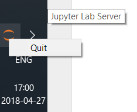

README
======

[Jupyter]: http://jupyter.org/

Launches [Jupyter][Jupyter](Lab) web server (and supplied browser) silently then sits in the tray bar allowing you to shut Jupyter down via tray menu.

Intended to be used in Windows only.

Installation
------------
If you have Jupyter installed in *Miniconda3*, and notebook root folder in `Documents\Notebooks`, create a shortcut (`.lnk`) with:

1. Target: `%USERPROFILE%\AppData\Local\Continuum\miniconda3\pythonw.exe %USERPROFILE%\Git\JupyterTray\jupyter-lab-tray-script.pyw %USERPROFILE%\Documents\Notebooks`

2. Start in: `%USERPROFILE%\Documents\Notebooks`

License
-------

Released under MIT license, see [LICENSE](LICENSE).

[SysTrayIcon]: http://www.brunningonline.net/simon/blog/archives/SysTrayIcon.py.html
[PSFL]: https://docs.python.org/3/license.html

`win32tray` (Aka [SysTrayIcon][SysTrayIcon]) is released under [Python Software Foundation License][PSFL]
